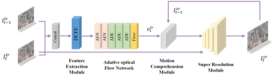

# DCANet-Pytorch

## Introduction

This is a PyTorch implementation of DCANet: Dual-contrast adaptive network for real-time inference video super-resolution(**VSR**)

## Dependencies
- Ubuntu >= 20.04
- NVIDIA GPU + CUDA & CUDNN = 11.3
- Python 3.9
- PyTorch >= 1.13.0
- Python packages: numpy, matplotlib, opencv-python, pyyaml, lmdb ([req.txt](req.txt))
- (Optional) Matlab >= R2016b


## Datasets
### A. Training Dataset
Download the official training dataset based on the instructions in [TOflow](http://toflow.csail.mit.edu/).

### B. Testing Datasets
* Vid4 -- Four video sequences: city, calendar, foliage and walk;
* Tos3 -- Three video sequences: bridge, face and room;
* GoPro11 -- eleven video sequence
All the dataset can download in the Data Availability.
Vid4 and ToS3 datasets are available in [TecoGAN-Pytorch](https://github.com/skycrapers/TecoGAN-PyTorch)
The GoPro11 dataset is available in [GoPro](https://seungjunnah.github.io/Datasets/gopro)

## testing
1 for testing:
```bash
bash ./test.sh BD DCANet
```

2 evaluate:
```bash
python ./codes/official_metrics/evaluate.py 
```

## training
```bash
bash ./train.sh BD DCANet
```


> 
